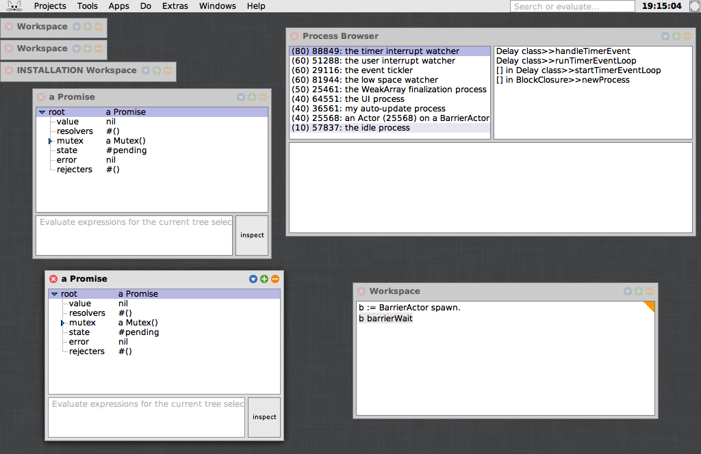
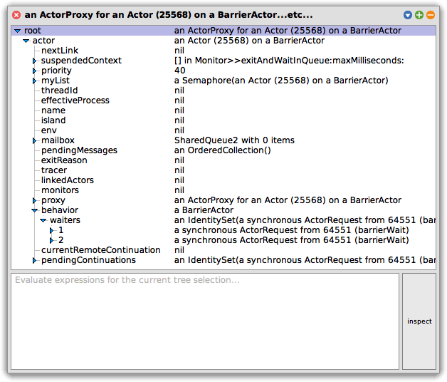
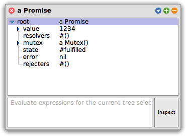

This tutorial introduces some more sophisticated control flow,
achieved through
[postponing transmission of replies to requests](behaviors.html#suspending-the-caller).

### BarrierActor

```smalltalk
ActorBehavior subclass: #BarrierActor
    instanceVariableNames: 'waiters'
    classVariableNames: ''
    poolDictionaries: ''
    category: 'Actors-Demos'
```

Class `BarrierActor` is a simple [`ActorBehavior`](behaviors.html)
that implements a *barrier*.

Clients may call `#barrierWait`, in which case they will not receive a
reply until some other client calls `#releaseWaiters` or
`#releaseWaiters:`.

Any value supplied to `#releaseWaiters:` is used as the resolved value
of waiting clients' promises; `#releaseWaiters` supplies `nil` as this
value.

The instance variable `waiters` holds an `IdentitySet` of
[`ActorRequests`](requests.html), the waiting continuations.

#### Initialization

```smalltalk
initialize
    super initialize.
    waiters := IdentitySet new.
```

#### Waiting for a value

```smalltalk
barrierWait
    waiters add: Actor caller.
```

Retrieving the current [request](requests.html) by invoking `Actor
class >> #caller`
[suspends the remote caller](behaviors.html#suspending-the-caller) of
the actor until either `resolveWith:` or `rejectWith:` is called on
the resulting `ActorRequest` object.

#### Releasing the current set of waiters

```smalltalk
releaseWaiters: anObject
    waiters do: [ :c | c resolveWith: anObject ].
    waiters := IdentitySet new.
```

Each of the waiting requests is released, with `anObject` as the reply
value given to the suspended caller via the [promise](promises.html)
associated with the request.

```smalltalk
releaseWaiters
    self releaseWaiters: nil
```

### Running an example

Exploring the behavior of `BarrierActor`s in a workspace must be done
with some care because of the way calls to `barrierWait` block until a
`releaseWaiters:` arrives from another actor.

Instead of using [blocking RPC](proxies.html#blocking-rpc), we will
use Promises and Squeak's explorer.

#### Creating a BarrierActor and some waiting promises

First, in a workspace, spawn a `BarrierActor`.

```smalltalk
b := BarrierActor spawn.
```

Then, type in

```smalltalk
b barrierWait
```

but instead of choosing "do it" or "print it", right click on that
line and choose "explore it" (or press `Shift-Alt-I`).

Select the workspace window again, and choose "explore it" on the `b
barrierWait` line a second time.

Your screen should now look something like this:



#### Exploring the state of the BarrierActor

At this moment, the two `Promise`s waiting for `barrierWait` to return
are associated with two instances of [`ActorRequest`](requests.html)
held in the `waiters` instance variable of the `BarrierActor`.

If we "explore it" on `b` in our workspace, and drill down to see the
behavior object, we can see the two requests sitting where they
should:



#### Releasing the waiters

Finally, "do it" with the following expression in the workspace:

```smalltalk
b releaseWaiters: 1234.
```

Both the promises have now changed—though the explorers do not
automatically update!

To update the view, click on the triangle next to "root" in each
explorer, to collapse the view of the promise, and then click a second
time, to reopen it.

After this, both explorer views on the promises should look like this:



#### Cleaning up

Finally, we can terminate our `BarrierActor`.

```smalltalk
b actor terminate.
```


